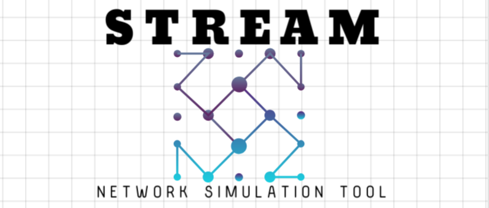

# Simulation and Traffic Routing for Efficient Allocation and Management




[](LICENSE)

This is a simulation project used for modelling the [Braess's paradox](https://en.wikipedia.org/wiki/Braess's_paradox) meant for traffic modelling. It gives an idea on how resources can be added or removed from an existing network in order to increase the overall efficiency of it.


The basis of the paradox relies on the Nash equilibrium that is established in a network when there is a flow of persons who would operate on a selfish or greedy behaviour. This looks at how allocation of resources can modify or impact the overall states of the network and all the users.
This project is a simulation outline of the scenarios possible or encountered when the network is operational and can be modified and extended to cover a greater range of situations where networks may be involved and resources need to be allocated. 

## Webpage:
Webpage of the project - [STREAM](https://sidzred.github.io/STREAM/). Check this source for more information about the project. This contains the detailed report and the guide for using this tool.

## Report: 
The detailed findings and report can be found in [Report](https://github.com/SidZRed/STREAM/blob/main/Braess_Paradox.pdf) and is a small report on testing over a very small network.


The simulation has been entirely built on python using [NetworkX](https://networkx.org/documentation/stable/index.html#) for the network anaysis.

## Project Structure

-   `build_graph.py`: Script to build the graph from a JSON file containing edge data.
-   `update_weights.py`: Script to update the weights of the edges based on traffic flow data.
-   `shortest_path.py`: Script to find the shortest path for a new person entering the network.
-   `analyze_braess.py`: Script to analyze Braess's paradox by removing and adding edges.
-   `main.py`: Script to loop through each pair of nodes, perturb each possibility, and analyze Braess's paradox.
-   `graph_data.json`: JSON file containing the graph structure.
-   `graph_flow.json`: JSON file containing the flow state of each edge in the graph.
-   `braess_analysis_results.json`: Output JSON file containing the results of the Braess's paradox analysis.

## Requirements

-   Python 3.x (x=10 or higher)
-   [NetworkX](https://networkx.org/documentation/stable/index.html#) - Python Package
-   JSON

Install the required Python packages using:

```bash
pip install -r requirements.txt
``` 

## Files Description

* ### `build_graph.py`

Constructs the graph from `graph_data.json`.

#### Usage

```bash
python build_graph.py
``` 
***

* ### `update_weights.py`

Updates the weights of the edges based on traffic flow data from `graph_flow.json`.

#### Usage

```bash
python update_weights.py
``` 
***

* ### `shortest_path.py`

Finds the shortest path for a given source and destination node in the graph.

#### Usage

```bash
python shortest_path.py
``` 

When run, it will prompt for the source and destination nodes.
***

* ### `analyse_braess.py`

Analyses Braess's paradox by removing and adding edges and checking the effect on the shortest path.

#### Usage

```bash
python analyse_braess.py
``` 

When run, it will prompt for the source and destination nodes.
***

### `main.py`

Loops through each pair of nodes, perturbs each possibility by removing and adding edges, and analyzes Braess's paradox.

#### Usage

```bash
python main.py
``` 
Runs the entire analysis of the network by running the above simulations.
***

## JSON Files

### `graph_data.json`

Contains the graph structure with the following format:
```json
{
    "edges": [
        {"start": "A", "end": "B", "base_weight": 1, "linear_factor": 1},
        {"start": "B", "end": "D", "base_weight": 1, "linear_factor": 1},
        {"start": "A", "end": "C", "base_weight": 1, "linear_factor": 1},
        {"start": "C", "end": "D", "base_weight": 1, "linear_factor": 1},
        {"start": "B", "end": "C", "base_weight": 1, "linear_factor": 1}
    ]
}
```
***

### `graph_flow.json`

Contains the flow state of each edge in the graph with the following format:

```json
{
    "flows": {
        "('A', 'B')": 10,
        "('B', 'D')": 10,
        "('A', 'C')": 10,
        "('C', 'D')": 10,
        "('B', 'C')": 0
    }
}
```

For the defaults, the json files have been included with basic random states for the purpose of providing examples.
***

### `braess_analysis_results.json`

Contains the results of the Braess's paradox analysis. Generated by running `main.py`.
***

## Running the Project

1.  Ensure you have the required Python packages installed.
2.  Ensure your `graph_data.json` and `graph_flow.json` files are properly set up.
3.  Run `main.py` to perform a comprehensive analysis of Braess's paradox on your graph:
    
    ```bash
    python main.py
    ``` 
    
5.  The results will be saved to `braess_analysis_results.json`.

## Support 
For any queries, bug reports or feature requests, please contact [@SidZRed](https://github.com/SidZRed)

## License

This project is licensed under the [MIT License](https://github.com/SidZRed/STREAM/blob/main/LICENSE).

## Credits
This project/ tool was created by [@SidZRed](https://github.com/SidZRed) as a part of a Game Theory reading and analysis project. Any contributions to the above are most welcome!
